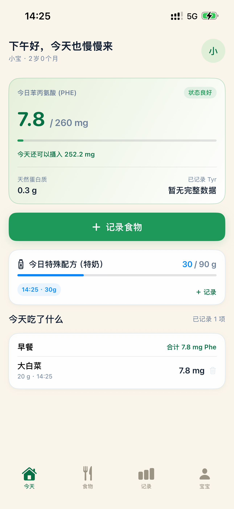
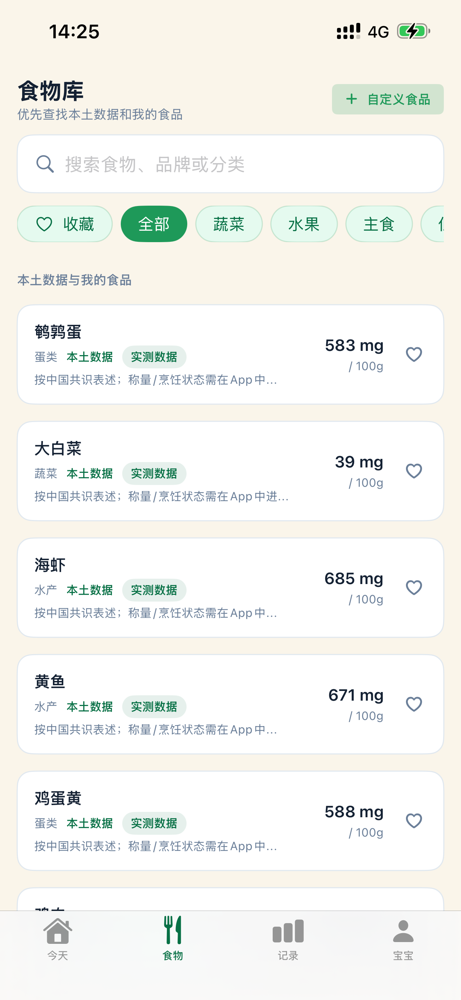
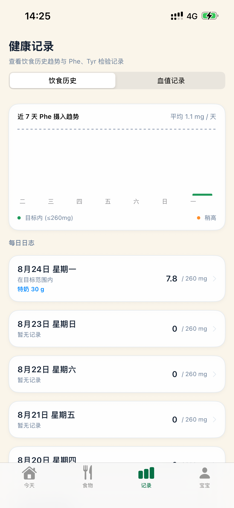
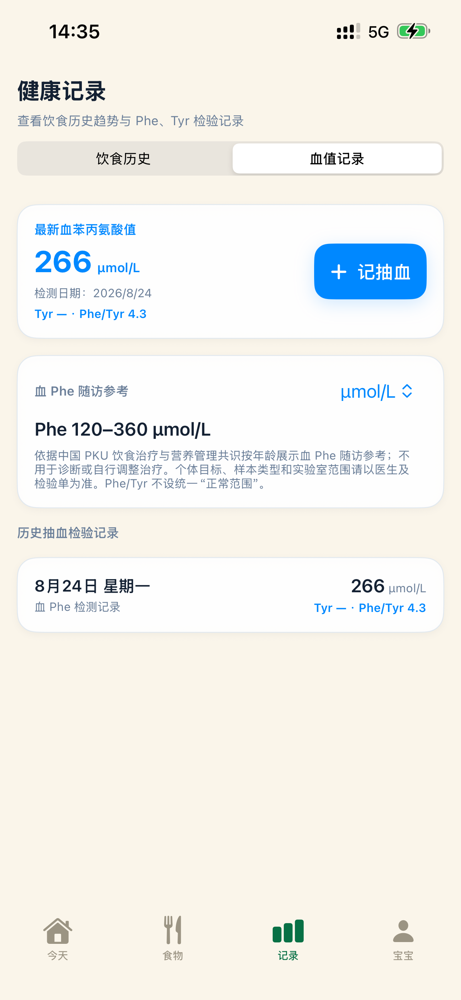
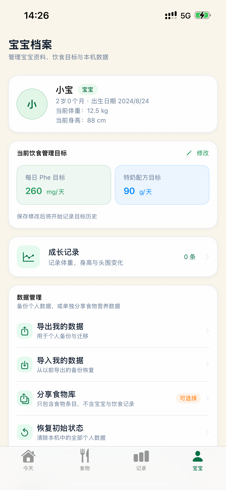

# PheCare Feedback

  
   
  <a href="./README.md">简体中文</a> | <strong>English</strong>

> User support, privacy information, feature requests, and bug reports for PheCare

PheCare is an iPhone and iPad daily record app for parents and caregivers of children with PKU. It helps users organize food intake, special formula, blood Phe test results, and growth measurements, with calculations and trend displays performed on the device.

This repository **does not contain the PheCare source code**. It is used to:

- Provide an overview of PheCare and its privacy policy
- Report crashes, incorrect displays, and compatibility issues
- Request features and suggest experience improvements
- Review known issues and planned improvements

> **Important**
>
> PheCare is a household record-keeping, numeric-conversion, and information-organizing tool. It displays sourced age-based reference ranges, editable starting values, and numeric comparisons with targets entered by the user, but it does not turn them into individualized actions. All ranges, starting values, conversions, and trends are for record keeping and information only and must not be used to independently adjust a dietary plan or special-formula amount.

## Key Features

- **Daily food records**: Record food weight by meal and summarize Phe intake
- **Special-formula records**: Record amount and time, including historical additions, editing, and deletion
- **Food library**: Browse common localized foods, custom foods, and optional USDA extended data
- **Blood test records**: Store Phe, Tyr, Phe/Tyr ratio, test date, and notes
- **Growth records**: Track weight, height, and changes over time
- **Offline data management**: Export or import a complete local backup, share custom-food packages, and reset local data

## Product Tour

<table>
  <tr>
    <td align="center" valign="top" width="50%">
      <strong>Easy setup</strong> 
      Create a baby profile and set dietary goals in three steps  
      
    </td>
    <td align="center" valign="top" width="50%">
      <strong>Today</strong> 
      See daily Phe, special formula, and meal records together  
      
    </td>
  </tr>
  <tr>
    <td align="center" valign="top" width="50%">
      <strong>Food library</strong> 
      Search localized data, custom foods, and extended references  
      
    </td>
    <td align="center" valign="top" width="50%">
      <strong>Diet history</strong> 
      Review intake trends and special-formula records by day  
      
    </td>
  </tr>
  <tr>
    <td align="center" valign="top" width="50%">
      <strong>Blood test records</strong> 
      Organize Phe, Tyr, ratios, and previous test results  
      
    </td>
    <td align="center" valign="top" width="50%">
      <strong>Baby profile</strong> 
      Manage growth details, dietary goals, and offline data  
      
    </td>
  </tr>
</table>

## Data and Privacy

The current version of PheCare does not require an account and does not include advertising, user tracking, or third-party analytics. Baby profiles, dietary records, blood test results, and growth records are not automatically transmitted to the developer.

Core data is stored locally on the user's device. Export and import actions must be initiated by the user. For details, see:

- [Privacy Policy (English)](./PRIVACY-EN.md)
- [隐私政策（简体中文）](./PRIVACY-ZH.md)

## Data Sources and Accuracy

Food entries identify their source, preparation state, and data type where possible. Some foundational nutrition data comes from USDA FoodData Central and is published under CC0 1.0. Chinese PKU references identify the relevant consensus or source material.

Food variety, origin, preparation, brand formulation, and production batch can all affect actual nutrient values. Estimates in the app are provided only to support record keeping; users should rely on product labels, manufacturer information, and data sources they have independently confirmed.

The age-based dietary Phe bands and blood Phe record-reference ranges come from the *Consensus Statement on Dietary Treatment and Nutritional Management for Phenylalanine Hydroxylase Deficiency*, *Chinese Journal of Pediatrics*, 2019, Vol. 57, No. 6, pp. 405–409, DOI: `10.3760/cma.j.issn.0578-1310.2019.06.002`. The in-app “References & Calculations” page also discloses the current rule-set version, starting-value rule, unit conversions, and Phe/Tyr derivation methods.

## How to Submit Feedback

Choose the appropriate template in [Issues](../../issues):

1. **Bug Report**: Crashes, failed saves, incorrect calculations, or display problems
2. **Feature Request**: New capabilities or improvements to existing workflows
3. **General Feedback**: Interface, wording, usability, and other suggestions

Before submitting:

- Search existing Issues to avoid duplicates
- Include your iOS version, device model, PheCare version, and reproduction steps
- Screenshots are welcome only after all sensitive information has been removed
- **Do not upload a child's name, birth date, blood values, testing-organization information, complete dietary records, or exported backup files**
- This repository handles product-use and data issues only; it does not provide individualized assessments or amount recommendations for a specific child

## What to Include in a Bug Report

1. iPhone or iPad model and operating-system version
2. PheCare version
3. Steps immediately preceding the issue
4. Expected and actual behavior
5. A redacted screenshot or error message, if available

For calculation issues, use fictional or redacted examples rather than real children's personal records.

## Open Discussion

Early ideas and informal conversations are welcome in [Discussions](../../discussions).

## What We Do Not Accept

- Personal data or children's private records
- Individual-condition assessments, management-plan requests, or special-formula amount requests for a specific child
- Spam, advertising, or unrelated promotions
- Piracy, cracking, or other unlawful content

## Contact

For technical support, privacy questions, or product feedback, email [xbeichenbei@gmail.com](mailto:xbeichenbei@gmail.com) or use [GitHub Issues](../../issues). Do not send a child's identifying information, real blood values, or a complete backup by email or in a public Issue.

## License

Documentation and feedback in this repository are used to support and improve PheCare. See [LICENSE](./LICENSE) for the repository license.
